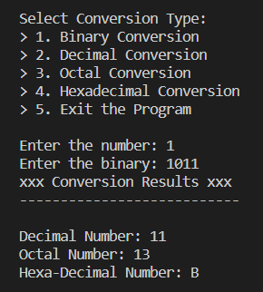
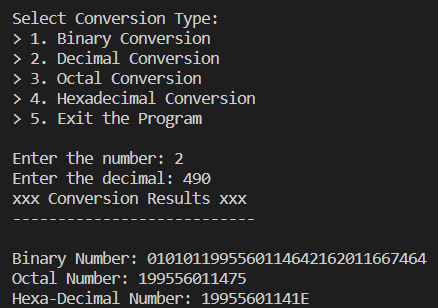
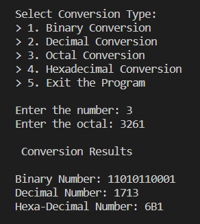
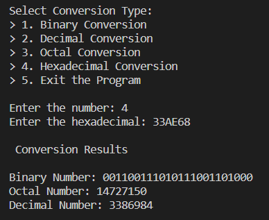

# Number System Converter in C

## Description
Convert any number system to other like Decimal, Binary, Octal, Hexadecimal.

## Conversions Offered
 - Binary to Decimal
 - Binary to Octal
 - Binary to Hexa-Decimal
 - Decimal to Binary
 - Decimal to Octal
 - Decimal to Hexa-Decimal
 - Octal to Binary
 - Octal to Decimal
 - Octal to Hexa-Decimal
 - Hexa-Decimal to Binary
 - Hexa-Decimal to Decimal
 - Hexa-Decimal to Octal
##

